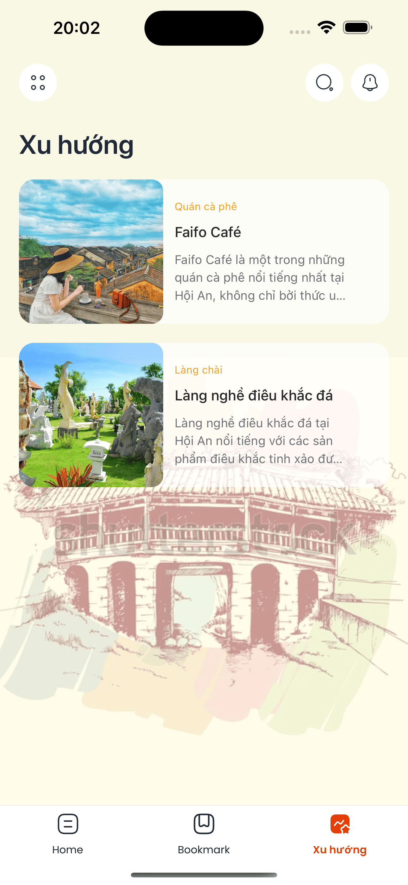
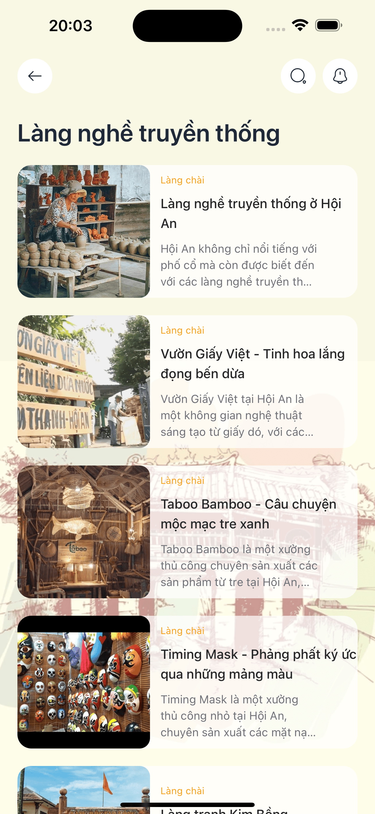

#  **Hoian Culture** 


Explore the cosmos like never before! Our **Hoian Culture** is designed to enhance the experience of exploring the rich cultural heritage of Hội An. By providing detailed information on tourist attractions, cultural events, and local activities, the platform serves as a comprehensive guide for visitors. In addition to information dissemination, Hoian Culture assists users in planning their trips by offering personalized tour suggestions, enabling them to fully immerse themselves in the unique traditions and experiences that Hội An has to offer!

---

## [DEMO - DRIVE](https://drive.google.com/drive/folders/1Gq_UQ7BHlZz_jRSTxfTk4AV0UqGB2PlT?usp=sharing)

---

## 🌍 **About**

Explore the rich heritage of Hội An with our **Hoian Culture App**! Discover fascinating informations about the city's historical sites and plan your perfect tour with tailored itineraries. This app serves as your comprehensive guide, helping you navigate the vibrant culture and traditions of this UNESCO World Heritage site. Whether you’re a curious traveler or a culture enthusiast, Hoian Culture offers an enriching experience that brings the beauty and history of Hội An to life!

---

## 🎨 **Features**

### 🏛️ **Cultural and Historical Information**

- **Detailed Descriptions**: Explore the rich history, architecture, and significance of Hội An’s famous landmarks.
- **Captivating Visuals**: Enjoy high-quality images that capture the beauty and essence of Hội An's cultural sites.

### 📅 **Tour Planning Assistant**

- **Personalized Itineraries**: Get tailored recommendations to help you plan the perfect visit to Hội An’s key attractions.
- **Time and Interest-Based Suggestions**: Choose your itinerary based on available time or specific cultural interests.
### 📍 **Event and Location Guide**

- **Local Event Updates**: Stay informed about upcoming cultural events, festivals, and activities.


---

## 📸 **Screenshots**

<div align="center">
  
  
  
  
  
  
  
  
  
  
  
</div>

---

## ⚙️ **Getting Started**

### 🛠 **Prerequisites**

Make sure you have these tools installed before starting:

- **[Node.js](https://nodejs.org/en/)** (v14+)
- **[Expo](https://docs.expo.dev/get-started/installation/)** CLI
- **[Yarn](https://classic.yarnpkg.com/lang/en/docs/install/#mac-stable)**

### 📥 **Installation**

1. **Clone the repository**:
    ```bash
    git clone git@github.com:NguyenQuocHuy1502/hoian-culture.git
    cd hoian-culture
    ```

2. **Install dependencies**:
    ```bash
    yarn
    ```

3. **Start the app**:
    ```bash
    yarn start
    ```
